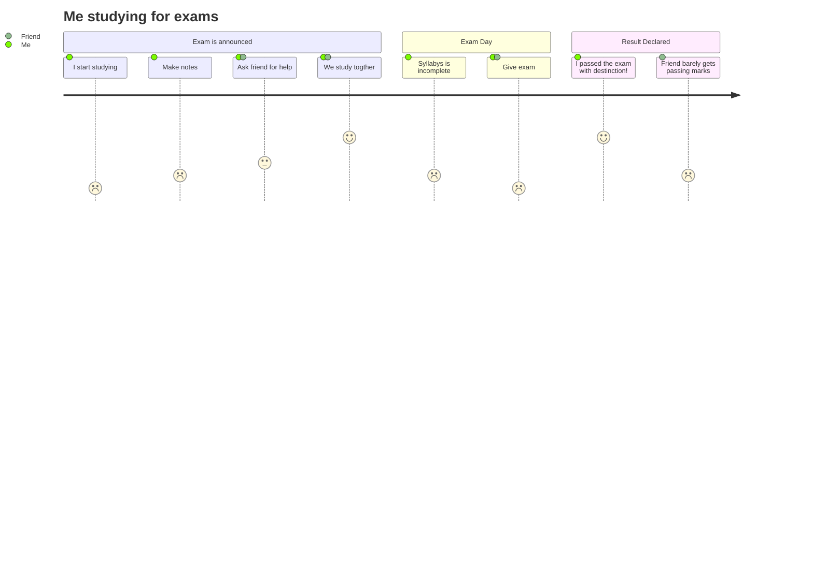

# Newsletter Concatenator Program

## Setup
A weekly newsletter with periodic reused content is HTML coded by hand.

## Problem
User newsletter generation is labor intensive, many parts remain unchanged or are swapped periodically, and asset records are entangled with content archives.

## Solution
Encode asset content and schedule metadata as object literals. Create JavaScript algorithm comparing pending to prior weekly contents. Make HTML template literals. Insert algorithm output. Update schedule metadata. Autogenerate newsletter HTML.

## Goals

## Features
### Inclusive
### Wishlist
### Implemented

## Schedule

## Architecture

