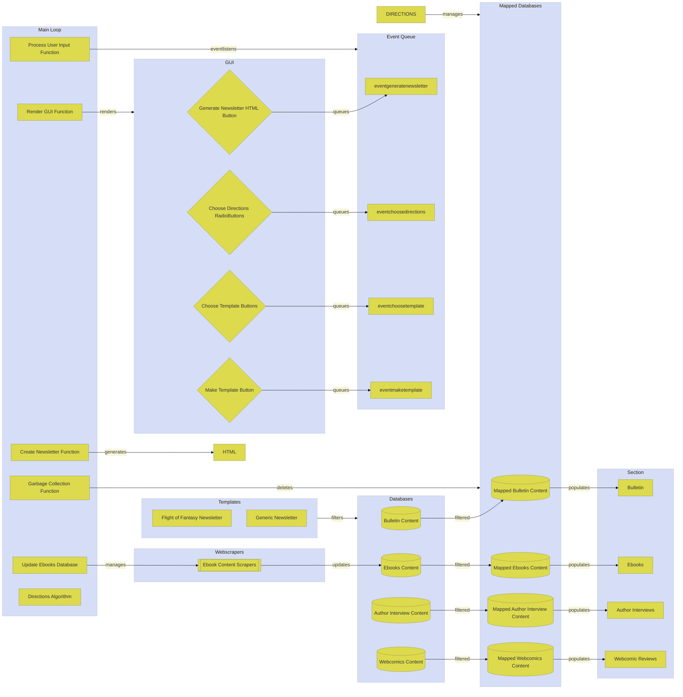

# Newsletter Concatenator Program
## Setup
A weekly newsletter with periodic reused content is HTML coded by hand.
## Problem
User newsletter generation is labor intensive, many parts remain unchanged or are swapped periodically, and asset records are entangled with content archives.
## Goals
- Automate repetitive tasks
- Optimize time management
- Organize and properly archive data
## Options
### Data Organization
- Text file HTML code [current]
- Object literals with key:value metadata
- JSON files with key:value metadata
### Data Search and Sort
- Manual [current]
- JavaScript algorithm
### Data Update
- Manual webpage search [current]
- Webscraper
### Newsletter Templates
- Text file HTML code with blanks [current]
- Template literal HTML code
### Newsletter Section Concatenation
- Manual [current]
- JavaScript algorithm
## Solution
Encode asset content and schedule metadata as object literals. Create JavaScript algorithm comparing pending to prior weekly contents. Make HTML template literals. Insert algorithm output. Update schedule metadata. Autogenerate newsletter HTML.
## System Architecture


## Development Schedule
```mermaid
%%{init: {'theme': 'base', 'themeVariables': 
{ 'primaryColor': '#DDDA4D', 'edgeLabelBackground':'#F7F6DA', 'tertiaryColor': '#D5DEF6'}}}%%
gantt
    dateFormat  YYYY-MM-DD
    title       Newsletter Concatenation Program Schedule
    excludes    weekends
    
    todayMarker stroke-width:5px,stroke:#0f0,opacity:0.5
    
    section Plan
    Define problem scope      :done,  scope, 2022-01-06,5d
    Define target user        :done,  user, 2022-01-06, 5d
    Draft readme              :done,  readmedraft, after user, 5d
    Iterate readme            :done,  readmeiterate, after readmedraft, 5d
    Draft designdoc           :done,  designdocdraft, after readmedraft, 5d
    Draft architecture        :done,  archituredraft, 2022-02-25, 3d
    Code architecture         :done,  architurecode, after archituredraft, 3d
    Draft gantt chart         :done,  ganttdraft, 2022-03-03, 3d
    Code gantt chart          :done,  ganttcode, after ganttdraft, 3d
    
    section Prototype
    Create sample databases    :done, databasecreate, 2022-01-05, 2d
    Create filter algorithm    :done, algofiltercreate, 2022-01-10, 3d
    Iterate filter algorithm   :done, algofilteriterate, algofiltercreate, 4d
    Create main program        :done, maincreate, 2022-03-10, 3d
    
    section Prune
    Softcode filter algorithm   :active, algofiltersoftcode, 2022-03-15, 3d
    
    section Playtest
    
    section Polish
    
    section Post
```
## Responsibilities
- keyed list (uml seq diagram)
## Features
### Critical Implemented
### Critical Unimplemented
- Encode jpeg/png images as base64
### Wishlist Unimplemented
- Design program to periodically activate and deactivate webscraper
- Implement timer program
- Design webscraper to update content
- Implement webscraper
- Implement button press command pattern
- Refactor NCP to use and parse content json files
- Add pixelart mousemovement input effects to theme selection logos
## Reference Code
- [Image File Pixel Encoding](https://www.youtube.com/watch?v=RCVxXgJ8xSk&t=842s)
- [Template Literals](https://www.youtube.com/watch?v=DG4obitDvUA&t=2069s)

